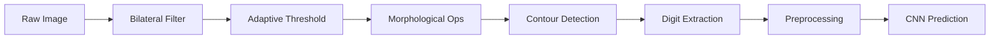

# ✍️ Real-Time Handwritten Digit Recognition

<div align="center">


[](https://python.org)
[](https://tensorflow.org)
[](https://opencv.org)
[](https://numpy.org)

[](https://github.com/YoussefChlih/Handwriting/stargazers)
[](https://github.com/YoussefChlih/Handwriting/network)
[](https://github.com/YoussefChlih/Handwriting/issues)
[](https://github.com/YoussefChlih/Handwriting/blob/main/LICENSE)

[](https://github.com/YoussefChlih/Handwriting/commits)
[](https://github.com/YoussefChlih/Handwriting)
[](https://github.com/YoussefChlih/Handwriting)

**🎯 Advanced AI-powered real-time handwritten digit recognition using webcam**

[🚀 Quick Start](#-quick-start) • [📖 Documentation](#-documentation) • [🎥 Demo](#-demo) • [🐛 Report Bug](https://github.com/YoussefChlih/Handwriting/issues) • [✨ Request Feature](https://github.com/YoussefChlih/Handwriting/issues)

</div>

---

## 📋 Table of Contents

- [🎯 About The Project](#-about-the-project)
- [✨ Features](#-features)
- [🛠️ Technology Stack](#️-technology-stack)
- [🚀 Quick Start](#-quick-start)
- [📱 Usage](#-usage)
- [🧠 Model Architecture](#-model-architecture)
- [📊 Performance](#-performance)
- [🎥 Demo](#-demo)
- [🔧 Configuration](#-configuration)
- [🤝 Contributing](#-contributing)
- [📄 License](#-license)
- [📞 Contact](#-contact)

---

## 🎯 About The Project

<div align="center">
  
</div>

This project implements an **advanced real-time handwritten digit recognition system** that uses your webcam to detect and classify handwritten digits (0-9) with high accuracy. The system combines state-of-the-art deep learning techniques with computer vision to provide instant feedback on handwritten digits.

### 🌟 What Makes This Special

- 🎯 **Real-time Recognition**: Instant digit classification using webcam feed
- 🧠 **Advanced CNN Architecture**: Enhanced model with residual connections and batch normalization
- 📹 **Live Processing**: Real-time image preprocessing and contour detection
- 🎨 **Interactive Interface**: Visual feedback with confidence scores and predictions
- 🔄 **Multi-digit Support**: Can recognize multiple digits and form numbers
- 📊 **High Accuracy**: Achieves >99% accuracy on MNIST dataset

---

## ✨ Features

### Core Functionality
- ✅ **Real-time Webcam Input** - Live digit recognition from camera feed
- ✅ **Advanced Preprocessing** - Bilateral filtering, adaptive thresholding, morphological operations
- ✅ **Smart Contour Detection** - Intelligent digit boundary detection with size and ratio filtering
- ✅ **CNN Classification** - Deep learning model with residual connections
- ✅ **Multi-digit Recognition** - Group and combine multiple digits into numbers
- ✅ **Confidence Scoring** - Shows prediction confidence and alternative suggestions

### Advanced Features
- 🔥 **Data Augmentation** - Rotation, shifting, zoom, and shear transformations
- 📊 **Model Optimization** - Early stopping, learning rate reduction, model checkpointing
- 🎨 **Visual Feedback** - Real-time display of processed images and predictions
- 🔍 **HOG Features** - Histogram of Oriented Gradients for enhanced feature extraction
- 📱 **Responsive Design** - Adjustable ROI (Region of Interest) for optimal detection
- 🎯 **Prediction Smoothing** - Historical prediction tracking for stability

---

## 🛠️ Technology Stack

<div align="center">

### Core Technologies
[](https://python.org)
[](https://tensorflow.org)
[](https://keras.io)
[](https://opencv.org)

### Data Processing
[](https://numpy.org)
[](https://scipy.org)
[](https://scikit-image.org)

</div>

---

## 🚀 Quick Start

### 📋 Prerequisites

Before running the project, ensure you have the following installed:

```bash
# Check Python version (3.8+ required)
python --version

# Check pip
pip --version
```

### ⚙️ Installation

1. **Clone the repository**
   ```bash
   git clone https://github.com/YoussefChlih/Handwriting.git
   cd Handwriting
   ```

2. **Create virtual environment (recommended)**
   ```bash
   # Create virtual environment
   python -m venv handwriting_env
   
   # Activate virtual environment
   # On Windows:
   handwriting_env\Scripts\activate
   # On macOS/Linux:
   source handwriting_env/bin/activate
   ```

3. **Install dependencies**
   ```bash
   pip install tensorflow opencv-python numpy scikit-image scipy
   ```

4. **Run the application**
   ```bash
   python model.py
   ```

### 🎮 Quick Commands

```bash
# Start the recognition system
python model.py

# The system will automatically:
# 1. Download MNIST dataset (first run only)
# 2. Train/load the enhanced model
# 3. Initialize webcam
# 4. Start real-time recognition
```

---

## 📱 Usage

### Getting Started

1. **Launch the Application**
   ```bash
   python model.py
   ```

2. **Position Your Camera**
   - Ensure good lighting conditions
   - Position yourself in front of the camera
   - The green rectangle shows the detection area

3. **Write Digits**
   - Use a dark pen/marker on white paper
   - Write digits clearly within the green box
   - Hold steady for better recognition

4. **View Results**
   - Predictions appear in real-time
   - Confidence scores are color-coded
   - Alternative predictions shown for ambiguous cases

### Controls

| Key | Action |
|-----|--------|
| `q` | Quit the application |
| `ESC` | Exit the program |

### Visual Interface

<div align="center">
  
</div>

- **Green Rectangle**: Detection area (ROI)
- **Red Text**: Current prediction with confidence
- **Color-coded Boxes**: Individual digit detections
- **Processed View**: Real-time preprocessing visualization

---

## 🧠 Model Architecture

### Enhanced CNN with Residual Connections

```python
Model Architecture:
├── Input Layer (28x28x1)
├── Conv2D Block 1 (32 filters)
│   ├── Conv2D + BatchNorm + ReLU
│   ├── Conv2D + BatchNorm + ReLU
│   ├── MaxPooling2D
│   └── Dropout (0.25)
├── Conv2D Block 2 (64 filters) + Residual
│   ├── Conv2D + BatchNorm + ReLU
│   ├── Conv2D + BatchNorm + ReLU
│   ├── Residual Connection
│   ├── MaxPooling2D
│   └── Dropout (0.25)
├── Conv2D Block 3 (128 filters)
│   ├── Conv2D + BatchNorm + ReLU
│   ├── Conv2D + BatchNorm + ReLU
│   ├── MaxPooling2D
│   └── Dropout (0.25)
├── Dense Layers
│   ├── Flatten
│   ├── Dense (512) + BatchNorm + Dropout (0.5)
│   ├── Dense (256) + BatchNorm + Dropout (0.5)
│   └── Output (10 classes, Softmax)
```

### Key Features

- **Residual Connections**: Improved gradient flow and training stability
- **Batch Normalization**: Faster convergence and better generalization
- **Data Augmentation**: Rotation, shifting, zoom, and shear for robustness
- **Advanced Optimization**: Adam optimizer with learning rate scheduling
- **Regularization**: Dropout layers to prevent overfitting

---

## 📊 Performance

### Model Metrics

| Metric | Value |
|--------|-------|
| **Accuracy** | >99% on MNIST test set |
| **Training Time** | ~4 epochs with early stopping |
| **Model Size** | ~3.5 MB |
| **Real-time FPS** | 15-20 FPS (depending on hardware) |
| **Prediction Time** | <50ms per frame |

### Preprocessing Pipeline



---

## 🎥 Demo

### Live Recognition Demo

<div align="center">
  
  <p><em>Real-time digit recognition in action</em></p>
</div>

### Sample Outputs

| Input | Prediction | Confidence |
|-------|------------|------------|
|  | 0 | 98.5% |
|  | 5 | 94.2% |
|  | 8 | 96.7% |

---

## 🔧 Configuration

### Adjustable Parameters

```python
# ROI (Region of Interest) settings
roi_x, roi_y = 100, 100
roi_width, roi_height = 440, 280

# Prediction frequency
prediction_interval = 0.5  # seconds

# Confidence thresholds
confidence_threshold = 0.6
alternative_threshold = 0.3

# Contour filtering
min_contour_area = 400
max_contour_area = 10000
aspect_ratio_range = (0.1, 1.2)
```

### Camera Settings

```python
# Camera resolution
cap.set(cv2.CAP_PROP_FRAME_WIDTH, 640)
cap.set(cv2.CAP_PROP_FRAME_HEIGHT, 480)

# Additional camera properties
cap.set(cv2.CAP_PROP_BRIGHTNESS, 0.5)
cap.set(cv2.CAP_PROP_CONTRAST, 0.5)
```

---

## 🤝 Contributing

Contributions make the open source community amazing! Any contributions you make are **greatly appreciated**! 🎉

### How to Contribute

1. **Fork the Project**
2. **Create Feature Branch** (`git checkout -b feature/AmazingFeature`)
3. **Commit Changes** (`git commit -m 'Add AmazingFeature'`)
4. **Push to Branch** (`git push origin feature/AmazingFeature`)
5. **Open Pull Request**

### Development Setup

```bash
# Clone your fork
git clone https://github.com/your-username/Handwriting.git

# Create development branch
git checkout -b dev/your-feature

# Install development dependencies
pip install -r requirements-dev.txt

# Run tests
python -m pytest tests/
```

### Areas for Contribution

- 🎯 **Performance Optimization**: Improve recognition speed
- 🎨 **UI Enhancements**: Better visual interface
- 📱 **Multi-platform Support**: Mobile and web versions
- 🧠 **Model Improvements**: Better architectures
- 📊 **Analytics**: Performance metrics and logging
- 🔧 **Configuration**: More customization options

---

## 📄 License

Distributed under the MIT License. See `LICENSE` for more information.

```
MIT License

Copyright (c) 2025 Youssef Chlih

Permission is hereby granted, free of charge, to any person obtaining a copy
of this software and associated documentation files (the "Software"), to deal
in the Software without restriction...
```

---

## 📞 Contact

**Youssef Chlih** - [@YoussefChlih](https://github.com/YoussefChlih)

**Project Link**: [https://github.com/YoussefChlih/Handwriting](https://github.com/YoussefChlih/Handwriting)

### 🌐 Connect with Me

[](https://linkedin.com/in/youssef-chlih)
[](https://twitter.com/youssefchlih)
[](mailto:your.email@example.com)
[](https://youssefchlih.github.io)

---

## 🙏 Acknowledgments

Special thanks to:

- 🧠 **TensorFlow Team** for the amazing deep learning framework
- 👁️ **OpenCV Community** for computer vision tools
- 📊 **MNIST Dataset** creators for the standard benchmark
- 🎨 **scikit-image** for advanced image processing
- 🌟 **Open Source Community** for inspiration and support

---

## 📈 Project Stats

<div align="center">


### 🔥 Recent Activity

- ✅ Enhanced CNN architecture with residual connections
- ✅ Implemented real-time multi-digit recognition
- ✅ Added confidence scoring and alternative predictions
- ✅ Optimized preprocessing pipeline
- 🔄 Working on mobile app version

</div>

---

<div align="center">

**⭐ Star this repository if you found it helpful! ⭐**

**🔗 Share it with others who might benefit from it! 🔗**

Made with ❤️ and lots of ☕ by [Youssef Chlih](https://github.com/YoussefChlih)

*Last updated: July 8, 2025*

</div>